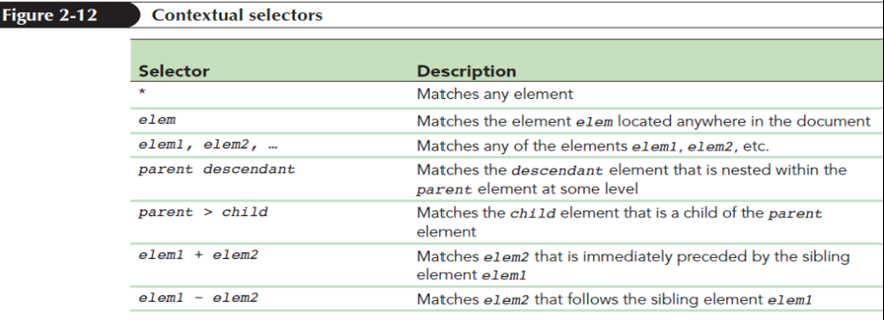
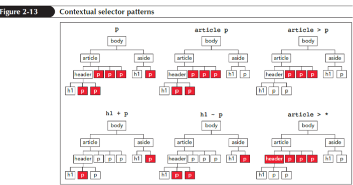
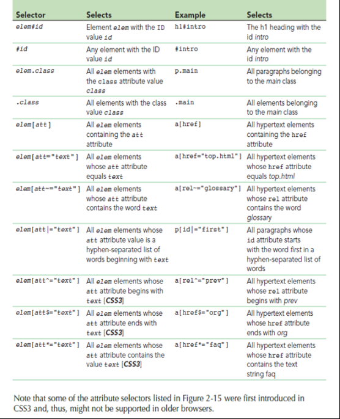

# Web Design & Development Mid Term Test 2019 Format & Tips

- [Web Design & Development Mid Term Test 2019 Format & Tips](#web-design--development-mid-term-test-2019-format--tips)
  - [Disclaimer](#disclaimer)
  - [Format](#format)
  - [*Theory questions*](#theory-questions)
  - [General](#general)
  - [Definitions (2m)](#definitions-2m)
    - [Notes](#notes)
    - [Chapter 1 Part 1](#chapter-1-part-1)
    - [Chapter 1 Part 2](#chapter-1-part-2)
    - [Chapter 3 Part 1](#chapter-3-part-1)
  - [Comparison (6m)](#comparison-6m)
    - [Chapter 2](#chapter-2)
    - [Chapter 3](#chapter-3)
    - [Excluded](#excluded)
  - [*Practical Questions*](#practical-questions)
    - [Chapter 1 Part 1](#chapter-1-part-1-1)
    - [Chapter 1 Part 2](#chapter-1-part-2-1)
    - [Chapter 2](#chapter-2-1)
    - [Chapter 3 Part 1](#chapter-3-part-1-1)
    - [Excluded](#excluded-1)

## Disclaimer

Before we begin, if you fail, its all on you. These are hints provided, I only took them as it is.

## Format

- 25 marks in total
  - Theory: 8 marks
  - Image maps: 4 marks
  - Relative & Absolute Folder Path: 4 marks
  - CSS Questions: 9 marks

## *Theory questions*

## General

Pay attention to the text highlighted in red color throughout the lecture notes, unless stated it will NOT come out below

## Definitions (2m)

### Notes

*NPD*: No proper definition in notes, skip if you want. Teacher most likely accept answer that makes sense since there are no references.

### Chapter 1 Part 1

- **Local Area Network**: Network in small geographic area, switch are intermediary devices

- **Web Browser (NPD)**: software that allows a user to locate, access, and display web pages

### Chapter 1 Part 2

- **Hypertext (NPD)**
  - created by enclosing content within a set of opening and closing `<a>` tags
  - Text with hyperlinks
- **Hyperlink (NPD)**
  - Reference to data that the reader can directly follow by clicking on it
- **Absolute path/relative path**
  - **Absolute path**: Precise location of file in computer's entire folder structure
  - **Relative path**:  File location in relative to current document's location

### Chapter 3 Part 1

- Controlling spacing & kerning
  - **Kerning**: Space between characters
    - `letter-spacing: value;`
  - **Tracking**: Space between words
    - `word-spacing: value;`
  - **Leading**: Space between lines
    - `line-height: size;`
  - **Text spacing**: Indentation
    - `text-indent: size;`

## Comparison (6m)

Differentiate/compare:

### Chapter 2

- Linear structure/augmented linear structure with hierarchical structure (mentioned x3) (C2)
  - Study C2: Definition of structures & its diagram to answer

### Chapter 3

- Content-box model & border-box model (mention x2)
  - With diagram
- Inline CSS vs External CSS vs Embedded CSS (mentioned x3)

### Excluded

- CSS font width (all the somewhat difficult settings)

## *Practical Questions*

Writing Code

### Chapter 1 Part 1

- Paragraph tag: `
...
`
- Headings tag: `<hn>...</hn>` where `n` is 1-6
- Inline images & alt text: ``

### Chapter 1 Part 2

- Image maps
  - `<map name="map" id="map">...</map>`
  - Hotspots: `<area shape="..." coords="coordinates" href="url" alt="text>`
    - Where `...` inside `shape` can be `rect`, `circle`, `polygon`, or `default`
    - `coordinates` are the coordinates of the points required by the `shape`
- Absolute & relative path
  - How to reach files
  - Absolute path:
    1. Know the root directory
    2. Write the entire path from root to file/folder
 - Relative path:
   - From the current directory, step to the intended location/file
   - Parent folder: `..`
   - Current folder: `.`
   - Example: `../scripts/myscript.js`
- Hypertext Link: `<a href="...">...</a>`
  - Image with hyperlinks: ``
  - Email: `<a href="mailto:...">...</a>`
  - Phone: `<a href="tel:...">...</a>`

### Chapter 2

None as far as I know.

### Chapter 3 Part 1

- Linking external stylesheet
  - `<link href="..." rel="stylesheet" (optional: type="text/css")>`
- Unvisited Link, Visited Link, Hover Link, Active Link
  - Unvisited:    `a:link`
  - Visited:  `a:visited`
  - Hover:      `a:hover` 
  - Active:     `a:active`
  - Ordering:
    - `a:hover` MUST come after `a:link` & `a:visited`
    - `a:active` MUST come after `a:hover`
  - *Honestly I can't find it in the notes. Creator of the notes, please improve your Web Usability Design using the tips in chapter 2*
- Contextual selectors
  - Scope
    - 
  - Pattern
    - 
  - Classes & IDs
    - 
- CSS Properties
  - `color`
  - `background-color`
  - `font-size`
  - `font-family`
  - `font-color`
  - `position` & the positioning properties: `top`, `bottom`, `left`, `right`
  - `text-align`

### Excluded

*Chapter 1*

- Aliases
  - No son of a `@charset`

*Chapter 2*

- Storyboard
- Anything from Chapter 2 EXCEPT diagram & definition for the website structures.
  - You win by reading this line

*Chapter 3*

- Table
- `
`
- Complicated stuff in practical
- All attribute values, they are given
- Z-index
- Comparing absolute & position values
- CSS grids
- Advantage of CSS
- Responsive design & fixed layout
- Web vendor prefix like `-moz-` stuff
- HSL meaning
- Given RGB color, ask RGB value
- Opacity
- Styling text