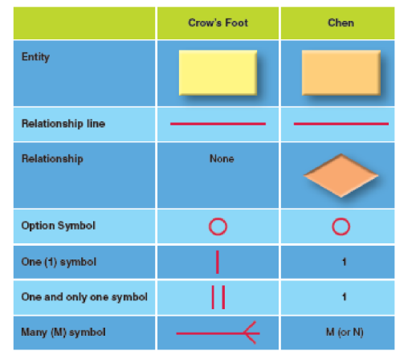

# C4: Fact Recording

## ADIS Lectures

## Entity Relationship Diagram

### ERD Notations

- Crow's foot
- Chen

Only need to remember Crow's Foot

### Entity

- Meaning: Class of person, places, objects, events or concepts

## Important Points (Rules on DFD)

### DFD Rules

- **Process Rules**
  - Transformation: Must have input and output, and they must be differ. Something must change.
  - Process number: Each process need to be numbered, but not necessarily according to sequence.
  - Process heading: Description of process should be a verb. Ex: `process`
- **Data Flow Rules**
  - Arrows: Must finish or start from a process.
  - Label: Every arrow must be labeled (except for arrows going into and out from data stores, those are optional)
- **Data store rules**
  - Numbers: Reference number

### Repeated diagrams

### Common Errors

- Miracle: Outputs, no input
- Black hole: Inputs, no output
- Gray hole: Input insufficient for output (Eg: current date -> inflation rate, like wot?)

## Components of ERD

- Entities
- Relationships

### Entities

- Class of persion places, objects, events or concepts about what we need to capture and store. 
- Represented by rectangular box.

### Relationships

- The relationship between one entities and another entities
- Represented by a line, utilizing cardinality

### Relations

- One-to-one relation (Koenigsegg One:1, jk) (1:1)
- One-to-Many relation (1:N)
- Many-to-Many relation (M:N)

### Crow's foot notation

- Describes number of relationship between entities
- Shows number of instance of entities that relate to another
- Cardinality in both direction is mandatory

### Resolving many-to-many relations

When dealing with many-to-many relations, data are lost. Therefore, we need something to "keep track" of both sides.

#### Associative entity, at your service

- Introduce two new pairs of (1:M) relationship.

### Purpose of ERD

- Business Rules - capture and describe business rules and relationship between the entities
- Modelling System - describe the business system in diagrams
- Users - communication system to the users for confirmation of requirements
- File design - from the basis of subsequent data and file design as the entities become physical files or data base tables.

## Relationship between DFD and ERD

- Data stores in DFD are related to entities in ERD
- DFD can be used as starting point for ERD.
- Relationship may not be 1:1

