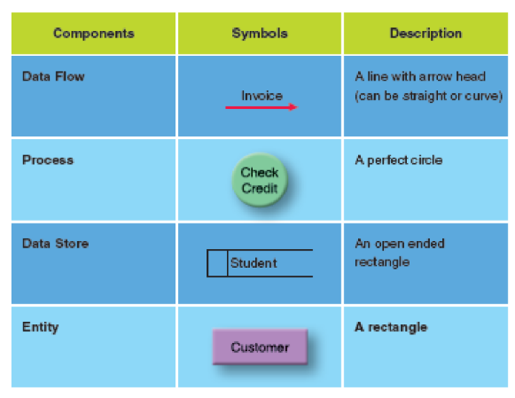
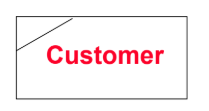

# C4: Fact Recording

## SDLC - recap

- System Request
- System Planning
- **System Analysis**
- System Design
- System Development
- System Implementation

**Mnemonic**: **R**efined **P**ickpockets **A**te **D**angerous **D**ocuments **I**llegally

## Part 2 - Fact Recording

- **Purpose:** To record facts about existing systems as reference for subsequent stages
- **Models Used (A.K.A. logical models): **
  - Narrative Description
  - Data Flow Diagram
  - Entity Relationship Diagram
  - Decision Tables
  - Decision Tree
  - Structure Diagram
  - Flowcharts
  - Organization Chart

## Data Flow Diagram (DFD)

**Definition: ** Models used to graphically document the operation of the current system.

- Standard symbols/notations for processes
- Diagramming notation: Process, data store, data flow, entity.
- Rules govern connections

### Notation (in TARUC)

### Data Flow

**Definition:** A path showing a specific piece of data moving from one part of IS to another

**Purpose:**

1. Understand business process / user problems
2. Describe 
   1. business process function
   2. scope and boundary
3. Gain user agreement & commitment

### Process

Describe main transformation within system. Change incoming data flows into outgoing data flows.

**Symbol**: Circle, active verb & noun

### Data Store

**Definition:** A file that shows information stored inside the system. Can be accessed and updated by processes.

**Symbol:** Open-ended rectangle, label with noun + number as identifier.

### Entities

**Definition:** Represent person, department, organization or other IS that receive/send information to the IS. 

- Extra: Also shows boundaries of IS.

**Symbol:** Rectangle, label: noun

### Steps to Draw

- Context Diagram -> DFD 0 -> DFD 1 until **functional primitive**

### Context Diagram

- **Definition:** Represents entire software element as 1 process + input + output + entities. 
  - Note: entities indicate boundaries.
- **Drawing**
  1. Draw 1 process, **number 0**
  2. Draw external **entities**
  3. Draw **data flows**

### Repeated Diagrams

- Avoid criss-crossing
  - Repeated data store, add extra line between number and title
    
  - Repeated entity, make a left-top paper fold.
    

### Important Notes

- Context Diagram DO NOT show data stores
- External entities, inflows, outflows remain same throughout context diagram, DFD0 and DFD1
- **Process Rules**
  - **Transformation**: Every process must have different inputs & outputs, cannot "pass-through" and remain the same.
  - **Process number**: Number processes, sequence not important
  - **Process heading**: Verb + noun
- **Data Flow Rules**
  - **Arrows**: Finish/Start at process
  - **Label**: Every arrow must be labelled except arrows go in/out from data stores is not required.
- **Common Errors**
  - Miracle (I like this): Has outputs, no inputs
  - Black hole: Has input, no outputs
  - Grey hole (like wtf): Input not enough for output
  - Data Store go straight to Data Store without intervening process.

## Entity Relationship Diagram

### ERD Notations

- Crow's foot
- Chen

Only need to remember **Crow's Foot**

### Entity

- Meaning: Class of person, places, objects, events or concepts

## Components of ERD

- Entities
- Relationships

### Entities

- Class of person, places, objects, events or concepts about what we need to capture and store. 
- Represented by rectangular box.

### Relationships

- The relationship between one entities and another entities
- Represented by a line, utilizing cardinality

### Relations

- One-to-one relation (Koenigsegg One:1, jk) (1:1)
- One-to-Many relation (1:N)
- Many-to-Many relation (M:N)

### Crow's foot notation

- Describes number of relationship between entities
- Shows number of instance of entities that relate to another
- Cardinality in both direction is mandatory

### Resolving many-to-many relations

When dealing with many-to-many relations, data are lost. Therefore, we need something to "keep track" of both sides.

#### Associative entity, at your service

- Introduce two new pairs of (1:M) relationship.

### Purpose of ERD

- **Business Rules** - capture and describe business rules and relationship between the entities
- **Modelling System** - describe the business system in diagrams
- **Users** - communication system to the users for confirmation of requirements
- **File design** - from the basis of subsequent data and file design as the entities become physical files or data base tables.

## Relationship between DFD and ERD

- Data stores in DFD are related to entities in ERD
- DFD can be used as starting point for ERD.
- Relationship may not be 1:1

