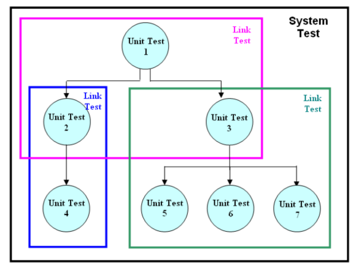

# C9: System Dev. - Test. & Doc.

## Testing the Program

### Program Translation

- **Purpose:** Translate program into machine code
- **Areas:** Identify syntax errors
- Correct, eliminates syntax errors and recompile

### Desk Checking

#### Reading/Inspecting

- Reading program, visually & mentally reviewing logic
- **Disadvantage:** Difficult to detect errors

#### Structured Walkthrough

- Present module to review team
- Detect errors, adherence to standards, requirements satisfaction
- Use feedback to further improve

## Types of Testing

### TL;DR: Summary of Tests (at least read this)

| Area           | Unit Test                                                    | System test                                        | UAT                                            |
| -------------- | ------------------------------------------------------------ | -------------------------------------------------- | ---------------------------------------------- |
| Purpose        | Ensure each function work correctly according to specifications. | Ensure all programs work correctly as one system.  | Ensure system meet Requirement Specifications. |
| Who Perform    | Programmers                                                  | End-users, operations group, project team          | Users                                          |
| Test-data Used | - Dummy/simulated data                                       | Live data                                          | Realistic Data                                 |
| Areas Covered  | Identify & remove syntax, logic, runtime errors              | Verify all processing, input, and output functions | Usability, business flow, functions.           |

### Unit Testing

- **Purpose:** Ensure each individual unit works correctly
- **Stub testing:**
  - **Stub:** Piece of code to temporarily replace missing function.
  - **Purpose:** Test program individually before integration

### Link / Integration Testing

- **Purpose:** Ensure data passes between functions correctly.
- Test multiple programs working together that interacts together.

### System Testing

- **Purpose**: Ensure all programs work correctly as whole system.
- **Who perform:** End-users, operations, **project team**

#### Scope of system testing

- **Interfaces:** Ensure system communicates with other systems well.
- **Business functionality:** Ensure functions defined in planning are correctly implemented.
- **Performance, volume, load test:** Ensure system can provide good performance under load.
- **Usability:** Ensure the system is consistent, adhere to standards, user-friendly.
- **Stability and reliability:** Ensure system can work reliably and recover for failures. Ensure error reporting mechanisms work.

### Performance (Load, Stress, Volume) Testing

- **Definition:** Exploring the limits of application performance under extreme conditions.
- **Method:** Use specialized simulations software
- **Purpose:** Test whether the system meets performance objective under predicted situations.
- **Importance:** 
  - Understand performance limits
  - Predict performance requirements
  - Understand effects of high load
- **Examples:**
  - **Order online:** Test effects during peak hours
  - **POS System:** Test multiple simultaneous transactions

### User Acceptance Testing

- **Definition**: Test to ensure system meets requirements inside Requirements Specification.

#### Types of Acceptance Testing

- **Alpha Test:** In-house test for single client at company. Simulates real environment.
- **Beta Test:** Carried out by customer at customer's place. Expose product to real use.
- **Benchmark test:** Test cases to represent typical conditions, evaluate performance.
- **Parallel Test:** New & old system run concurrently, and evaluate results. 

## Use of Automation in Testing

### Automated Testing Tools

- **Importance:** Save cost, improve quality on tests
- **Examples:** Computer Aided Software Testing (CAST) tools.
- **Common Tasks:**
  - Repeat tests
  - Check performance
  - Check results
  - Simulate interface
- **Advantages:**
  - **Save time**: Multiple tests at one time
  - **Predict performance**: Can easily stress test system
  - **Diagnoses**: System designer/programmer get fast feedback.

## Documentation

### TL;DR

| Differences                     | End User Doc.                                 | Operation Doc.                                               | System Doc.                                                  | Program Doc.                       |
| ------------------------------- | --------------------------------------------- | ------------------------------------------------------------ | ------------------------------------------------------------ | ---------------------------------- |
| Prepared by                     | Analyst & Programmers                         | System Analyst                                               | System Analyst                                               | Programmers                        |
| Used by                         | Users, trainers                               | Operation staff                                              | Designers, programmers                                       | Programmers                        |
| Purpose                         | To train users to use software, self-learning | Assists  in operating the system, plan tasks, share printed outputs. | Describe features and their implementation in IS             | Maintenance/enhancement            |
| Content (just remember any 2-3) | Input,output procedures, errors               | Backup & recovery procedures, security procedures, set-up procedures | Data dictionary entries, DFD, screen layouts, source documents, system request form. | Flowcharts, code, notes, test data |

### 1. End user documentation

- **Contents**:
  - **Input**. Describe procedures to use.
  - **Output:** Describe type and forms
  - **File amendment procedures.** Explain requirements.
  - **Error reports.** Explain on errors & action to be taken.

### 2. Operation Documentation

- **Contents:**
  - System set-up procedures
  - Security procedures
  - Reconstruction control procedures (eg. file backup and recovery)
  - System messages  & actions to be taken

### 3. Program Documentation

- Begins in System Analysis, complete after testing

### 4. System Documentation

- Begins in System Analysis, completes in System Development

## Exam Tips

Testing Part & Documentation Part.

Contribution and Significance of Automated Testing Tools - no questions in past year. 