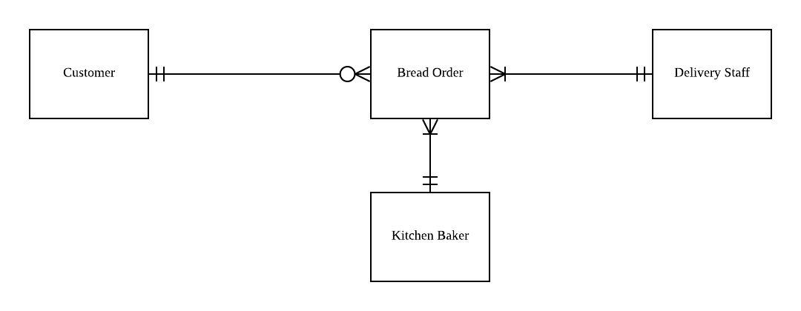

# Question 1

## a)

**System request** is a formal request for services of IS department, in this case, Mr. Leonardo, a system analyst. 

## b)

Two sources of system request, cannot randomly choose, must based on case scenario.

1. **Users Need**

Long term customers demand to have online based ordering system.

2. **Directives from Top Management**

Rephrase from the question. The business owner wish to convert traditional model to online selling.

### c)

**Better service** - allow customers to order faster

**Better information** - allow Miss Felicia to obtain more information and produce more detailed and useful reports

### d)

Note: For this question cannot just write keyword, must also write details

**Development costs**

- New purchase of hardware
- New software installation
- Prepare a new space to place the hardware

**Possible intangible benefits**

- Improve company reputation/image
- Customer retention
- Provide convenience to the customer. Able to purchase bread directly.
- Improve customer satisfaction.

### Part E

Technical feasibility

- **Data input**
  - Evaluate whether the new bread system is able to read the high volume of data input without any issues.
- **Output**
  - Whether the new online bread sales system can produce accurate output. Ex: Bread transfer details to customer
- **Response time**
  - Whether this new system can respond fast to customer request. E.g.: Customer request for delivery status of bread order.
- **Number of users**
  - Whether this new bread system is able to support high number of customers at he same time when they use the system to order without issues.
  - Growing number of customer in the future.

## Q2

### Part A

#### Part 1

#### Part 2

#### Part 3

Total time required: **31 weeks**

#### Part 4

The overall duration of the project will remain the same. This is because the delayed time, 3 days, is less than the slack time allocated for activity C, which is 2 weeks.

## Q3

### Part A

Possible answers:

**Observation (Most appropriate), Questionnaire.**

Justification:

**Should give advantages.**

**Observation** (each must include elaboration as per the lecture notes)

- **Cross-check and verify.** By observing Miss Felicia's current bread selling process, Mr. Leonardo is able to ensure that the information obtained via phone interview is accurate to Miss Felicia's current procedures.
- Additional perspective.
- Better acceptance.
- Acquire know-how.
- Better acquaintance.
- Environmental conditions.

### Part B

E: Customer
Data store: Customer, order
Processes:

- 2.1 (Receive customized bread order details/requests)
- 2.2 (Verify customer information)
- 2.3 (Calculate the total payment)
- 2.4 (Generate order confirmation note)

### Part C

Entities: Customer, Bread Order, Kitchen Bakr, Delivery Staff

## Q4

### Part A

- Note: **simplified** decision table means require eliminating unnecessary conditions
- Conditions:
  - Score 5 credits and above
  - Credit in English subject
  - Obtain a faculty recommendation letter
- Actions:
  - Eligible to enroll
  - Require to attend an English class
  - Application rejected
- Total combinations
  - 2^3=8

| **Conditions**                         | 1    | 2    | 3    | 4    |
| -------------------------------------- | ---- | ---- | ---- | ---- |
| Score 5 credits and above              | Y    | Y    | Y    | N    |
| Credit in English subject              | Y    | N    | N    | \~   |
| Obtain a faculty recommendation letter | \~   | Y    | N    | \~   |
| **Actions**                            |      |      |      |      |
| Eligible to enroll                     | X    | X    |      |      |
| Require to attend an English class     |      | X    |      |      |
| Application rejected                   |      |      | X    | X    |

### Part B

#### Part 1

One type of code is **block sequence code**. 

- **Sequence code.** 
- By using sequence code, the system can automatically assign a code for every new customer, reducing the user input from the staff. This reduces the possibility of user input errors.

#### Part 2

One characteristic of good code is **expandability**. The code must allow for future growth.

### Part C

1. **Consistent design**
   1. Similar operations should be activated the same way
2. **Familiarize users**
   1. Use terms and concepts that user anticipate from past experiences.

