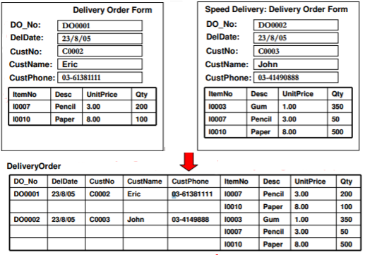
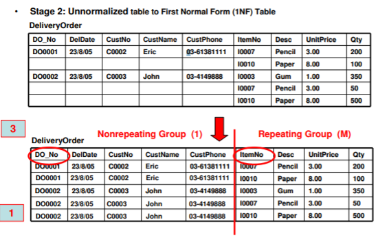

# Lecture 5: Normalization

## Disclaimer

This topic. Lets just say that I barely understand it, but I'm not even close to be able to put it clearly in words. If you find anything confusing, please let me know, I'll try to simplify it.

## Table Of Contents

[TOC]

## l33t terminology

### Example + Explanation

| Rental   |         |            |            |         |
| -------- | ------- | ---------- | ---------- | ------- |
| RenterNo | OwnerNo | StartDate  | EndDate    | Rent    |
| R0001    | O0001   | 01/01/2010 | 31/12/2010 | 800.00  |
| R0001    | O0001   | 01/01/2011 | 31/12/2011 | 850.00  |
| R0001    | O0002   | 01/01/2012 | 31/12/2012 | 900.00  |
| R0001    | O0001   | 01/01/2013 | 31/12/2013 | 1000.00 |
| R0002    | O0002   | 01/01/2010 | 31/12/2010 | 900.00  |
| R0002    | O0001   | 01/01/2012 | 31/12/2012 | 950.00  |

1. **Superkey**: One or more columns (combined) to identify rows
   - RenterNo, OwnerNo, StartDate
   - RenterNo, OwnerNo, EndDate
   - RenterNo, OwnerNo, StartDate, EndDate
   - RenterNo, OwnerNo, StartDate, Rent
   - RenterNo, OwnerNo, EndDate, Rent
   - RenterNo, OwnerNo, StartDate, EndDate, Rent
   - **Note:** If table don't have code, then you can select Name. But most time use code.
2. **Candidate Keys**: Key in row, determines all other column (shortest superkey)
   - RenterNo, OwnerNo, StartDate
   - RenterNo, OwnerNo, EndDate
3. **Primary Keys**: Primary way to identify row (Best/any from candidate key)
   - RenterNo, OwnerNo, StartDate
4. **Alternate Keys**: Candidate key which is not primary key / selected as the primary way to identify row.
   1. RenterNo, OwnerNo, EndDate
5. **Composite Keys:** Multi-column key.
   - RenterNo, OwnerNo, StartDate
   - RenterNo, OwnerNo, EndDate
   - RenterNo, OwnerNo, StartDate, EndDate
   - RenterNo, OwnerNo, StartDate, Rent
   - RenterNo, OwnerNo, EndDate, Rent
   - RenterNo, OwnerNo, StartDate, EndDate, Rent
6. **Foreign Key** : PK of one table/relation, placed in another table/relation to link them together.
   - RenterNo
   - OwnerNo
7. **Secondary Key**: Key to store data. It is NOT PK or FK. It is also optional.
   - StartDate
   - EndDate
   - Rent

## Normalization

- **Definition**: Process to evaluate and correct table structures to minimize data redundancies
- **The five importance of normalization** (Exam may have):
  • Reduce the data redundancy.
  • Reduce the storage space.
  • *Eliminate the insertion anomaly.* 
  • *Eliminate the deletion anomaly*.
  • *Eliminate the modification anomaly.*
- **The stages of normalization:**
  - 0NF - Convert source document to unnormalized table.
  - 1NF - First Normal Form
  - 2NF - Second Normal Form
  - 3NF - Third Normal Form

## Step 0: Important hints

### **Selection of primary key** 

- Must be done at all NF
- Usually done at the end
- Without PK, it is not a valid table.

- Primary key are highlighted with underline (eg: <u>primaryKey</u>)

#### Priority Of Selection

1. 1 code
2. 1 date
3. 2 code
4. 1 code + 1 date
5. 2 code + 1 date
6. 1 code + 1 date + 1 time

### Foreign Keys

**Foreign keys (FK) start to appear at 1NF**. Indicate with asterisk (*), can be primary & foreign together.

## Step 1: Source Document -> Unnormalized

### Procedure

- Convert source documents into unnormalized table
- Find the appropriate PK

### Example

- **Convert source documents into unnormalized table**
  - **DeliveryOrder**(DO_No, DelDate, CustNo, CustName, CustPhone, ItemNo, Desc, UnitPrice, Qty)
- **Find the appropriate PK**
  - 1 code :heavy_check_mark: (DO_No)
- **End result:**
  - **DeliveryOrder**(<u>DO_No</u>, DelDate, CustNo, CustName, CustPhone, ItemNo, Desc, UnitPrice, Qty)

## Problems with unnormalized table (Hot topic in exams, stick them up your refrigerator)                                                                                                                                                                                         

### Insertion Anomalies :writing_hand: (Solved at 1NF)

- **Definition:** New record must be added with redundant data.
- **Typical example writing:** It is not possible to add [something] unless a new [something] is [also added]
  - Replace [something], [also added] with appropriate terms

### Updating/Modification Anomalies :cyclone: (Solved at 2NF)

- **Definition**: Cannot maintain data accurately and efficiently. Multi-column changes are required for every change.
- **Typical example:** When we update ... (record identifier) from .... to ...., we also need to update ... in another row, if not it will cause data inconsistency.
  - Replace ... with appropriate terms
  - Replace (record identifier) with appropriate record identifier, e.g. (DO001)
  - **Caution**: The updates must make sense, for example in exam, updating from 'Titanic' to 'Titanic 2' makes sense but to 'GPS signal lost' is a lost cause and could lose you marks.

### Deletion Anomalies :do_not_litter: (Solved at 3NF)

- **Definition:** Cannot delete unwanted data without also deleting wanted data.
- **Typical example:** When we delete ... (record identifier) record we also will delete the ... (linked data field). CLARIFY with teacher.
  - Replace ... with appropriate terms
  - Replace (record identifier) with appropriate record identifier, e.g. (I001)

## 1NF: First Normalizing Form - remove repeating group

To address unnormalized form problems, we will need to:

2. Break into **non-repeating group** and **repeating group** tables
   1. **Repeating group**: The 'common' stuff, like a category or a non-unique item.
   2. **Non-repeating group**: are the 'unique' stuff, like a person.
2. Select **Primary Key** (PK) for both of the tables

### Example

### Step 1: Break into non-repeating & repeating group

> **DeliveryOrder**(<u>DO_No</u>, DelDate, CustNo, CustName, CustPhone, ItemNo, Desc, UnitPrice, Qty)

Becomes:

> **DeliveryOrder**(DO_No, DelDate, CustNo, CustName, CustPhone) 
>
> **DeliveryItem **(ItemNo, Desc, UnitPrice, Qty, DO_No*)

### Step 2: Select Primary Key

**DeliveryOrder**(<u>DO_No</u>, DelDate, CustNo, CustName, CustPhone)

- 1 code? :heavy_check_mark: (DO_NO)

**DeliveryItem **(<u>ItemNo</u>, Desc, UnitPrice, Qty, <u>DO_No*</u>)

- 1 code (ItemNo / DO_No*)? :x:
- 2 code (ItemNo + DO_No*)? :heavy_check_mark:

### End result

> **DeliveryOrder**(<u>DO_No</u>, DelDate, CustNo, CustName, CustPhone)
>
> **DeliveryItem**(<u>DO_No*</u>, <u>ItemNo</u>, Desc, UnitPrice, Qty)

## 2NF: Remove partial dependency

- **Partial Dependency** 
  - **Definition**: Fields that depend on a part of primary key, but not all primary keys
  - **Explanation**: They are 'partial' because they do not depend on the entire primary key.
  - When the entire primary key is referenced, and an update is made, the update is not applied to the partially dependent values, hence causing **update/modification anomaly**
  - Therefore, 2NF resolves this.

### Example

#### From 1NF:

> **DeliveryOrder**(<u>DO_No</u>, DelDate, CustNo, CustName, CustPhone)
>
> **DeliveryItem**(<u>DO_No*</u>, <u>ItemNo</u>, Desc, UnitPrice, Qty)

#### Changed to:

> **DeliveryOrder**(<u>DO_No</u>, DelDate, CustNo, CustName, CustPhone)
>
> **DeliveryItem**(<u>DO_No*</u>, <u>ItemNo*</u>, Qty)
>
> **Item**(<u>Item_No</u>, Desc, UnitPrice)

## 3NF: Remove transitive dependency

### Transitive Dependency 

- **Definition**: an indirect relationship between values in the same table that causes a [functional dependency](https://www.lifewire.com/functional-dependency-definition-1019257). 

- A transitive dependency requires three or more attributes (or database columns) that have a functional dependency between them. 

- Briefly, this means that, assuming we have a table with 3 fields, BOOK(<u>Book</u>, Author, and AuthorsLocation). Now, instead of ONLY

  > column A in a table, determines column B.
  >
  > Eg: Book Determines Author
  >
  > column B in a table, determines column C.
  >
  > Eg: Author determines Authors_Location

  We have one extra

  > Column A in a table, determines column C
  >
  > Eg: Book determines author location

  

- A book should never determine the author's location.

To achieve the normalization standard of Third Normal Form (3NF), we must eliminate any transitive dependency, which means eliminating deletion anomaly. (For more info: [See Lifewire's Transitive Dependency](https://www.lifewire.com/transitive-dependency-1019760))

**This means to create a new table to store both column B and column C. Then, link the column A to the new table.**

## Guide to making 2NF, and 3NF

This is a direct extract from: 

> https://stackoverflow.com/questions/16152167/normalization-dependencies
>
> Normalization Dependencies
>
> ]
>
> ]https://stackoverflow.com/users/3948664/dhruv-ghulati

**Full Functional Dependencies**

Identify the **candidate keys** **(here, propertyNo, iDate and pAddress)**. This is because any combination of those 3 can allow you to find what the other attributes are for a given tuple (I can find the staffNo that did the inspection given those three things, I can find the carReg the staffNo used given those 3 things etc.). But note, you need **all of those 3 to find the other attributes, not just a subset.** **Full dependencies always relate to non-candidate keys depending on candidate keys, either depending on all or depending on some.**

**Partial Dependencies**

Given those three candidate keys, look within the candidate keys. Is there any subset(s) of the candidate key which is dependent on the other? Yes, it is pAddress. Given a propertyNo, you can figure out what the address of the property. Then look outside of the candidate keys. Is there any of these keys that depend on only parts of the candidate key, not all components? In this case there are not. So **partial dependencies are always dependencies within the candidate keys or dependencies of non-candidate keys on only parts of the candidate keys rather than all components**

**Transitive Dependencies**

Now, look at the non-candidate keys (staffNo, comments, iTime (inspection time), sName, carReg). Within those, is there anything that is functionally dependent on the other? Yes, it is sName - given a staffNo, you can figure out the name of the staff member. But staffNo is functionally dependent on the 3 candidate keys. So by transitivity, propertyNo + iDate + pAddress -> staffNo -> sName, so **sName is transitively dependent on staffNo**. **Transitive dependencies always relate to attributes outside of candidate keys.**