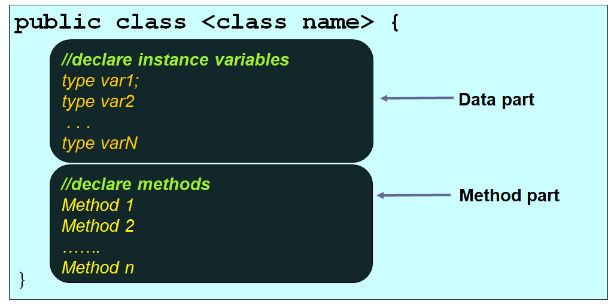
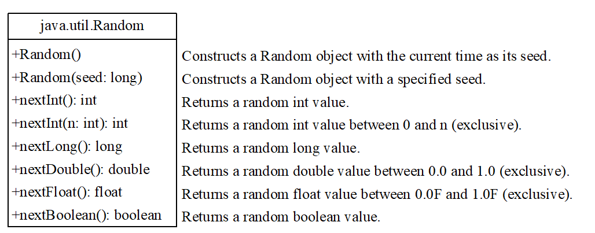

# C4: Objects & Classes

## Objectives

- Describe **objects and classes**.
- Use **UML** graphical notations to model classes and objects.
- Declare a class and create an object from a class.

## Procedural Paradigm VS. Object-oriented Paradigm

| Procedural Paradigm            | Features               | Object-Oriented Paradigm               |
| ------------------------------ | ---------------------- | -------------------------------------- |
| Loose coupling                 | Data & methods         | Coupled into objects                   |
| Focus on methods               | Software design        | Focus on objects                       |
| Require sending data to object | Data & Method handling | All data and operations within objects |

## OOP Concepts

### Objects

- Distinctly identifiable **entity**
- **A physical representation / Instance** of class
- Has **unique identity, state, and behaviors**
  - **State**: defines objects, contains data fields / properties
  - **Behavior**: defines what object does, defined by methods

### Classes

- **Constructs**, a template that define object of same type.
- A **logical abstraction**, define data and actions.
- Contains:
  - **Variables:** Data fields
    - AKA **Data members**
    - Nouns of class
    - Represent state
  - **Methods:** Behaviors
    - Functions/actions
    - Verbs
    - Code that operate on data
    - Object's behavior

Example:

```java
class amazingClass {
    /* Data field */
    int amazingness = 2;
    
    /* Constructors */
    amazingClass() {}
   	amazingClass(int newAmazingness) {
        amazingness = newAmazingness;
    }
    
    /* methods */
    int getAwesomeness() {
        return amazingness;
    }
}
```

## Object Syntax

- Declare object reference variables

  - `ClassName objectRefVar;`

- Declaring/creating objects in one step

  - `ClassName objectRefVar = new ClassName()`;

- Accessing objects

  - `objectRefVar.data`

- Defining a class

  - General form

    

## Default Value for Data Field

| Data Type      | Default Value |
| -------------- | ------------- |
| Reference type | `null`        |
| Numeric type   | 0             |
| Boolean type   | `false`       |
| character type | `\u0000`      |

## Constructors

**Constructors:** Special kind of method to construct objects.

- must have **same name as class**
- **no explicit return type**, not even `void`

### Type of constructors

- **no-arg constructor**: constructor without parameters (good practice to always declare)

- **parameterized constructors**: Constructors with parameters

- **default constructor: ** only exist if no constructor are declared, implicitly provided.

### Constructor operators

#### `new` Operator

- Create a new object from a constructor inside a class.
- Eg: `Vehicle car = new Vehicle("WWW 1234")`

## NullPointerException

- An @channel meme (Steins;gate 0 reference)
- Common error, occurs when invoke a method onto a variable/field with `null` value.

## Primitive & Object Data Type

- Primitive: have their entire contents stored in the "stack".
- Object: store a pointer in the "stack", that points to a data block in the "heap". Because objects usually use far more space than primitive variables. (Remember, stack is very limited in size compared to heap)

## `Date` Class

- Creates an instance for current date and time


## `Random` class



## Static Variables, Constants, and Methods

### Static Variables

- Shared by all instances of the class (its 'static' across all objects)
- **Access**: Use **object/class name** 
- Stored in **common memory location**

### Static Methods 

- Tied to class instead of objects

**Static constants: **

- **Final variables, shared by all instances of classes** 
- (Note: in Java, `static` and `final` are different, `final ` cannot be changed ever. `static` can be changed, but affects all instances of the class) 

### Static Pitfalls (what a pun!)

|                                 | Type of methods | Instance           | `static`           |
| ------------------------------- | --------------- | ------------------ | ------------------ |
| **Var. and methods** **usable** |                 |                    |                    |
| Instance                        |                 | :heavy_check_mark: | :x:                |
| `static`                        |                 | :heavy_check_mark: | :heavy_check_mark: |


- `static` variables & methods can be used from `instance` or `static` methods. 
- `instance` variable & methods can only be used in `instance` methods.

### Naming & Accessing guidelines

- Access static variable: `ClassName.staticVariable`
- Invoke static method: `CassName.staticMethodName()`

## Visibility modifiers

- Prevent misuse of objects

| Modifiers   | Visibility         |                    |                    |                   |
| ----------- | ------------------ | ------------------ | ------------------ | ----------------- |
|             | In any package     | In same package    | In declaring class |                   |
| `public`    | :heavy_check_mark: | :heavy_check_mark: | :heavy_check_mark: |                   |
| `default`   | :x:                | :heavy_check_mark: | :heavy_check_mark: |                   |
| `private`   | :x:                | :x:                | :heavy_check_mark: |                   |
| `protected` | :grey_question:    | :grey_question:    | :grey_question:    | Research yourself |

- Visibility modifiers:
  - `default`: can be accessed by all class in same package/folder
  - `public`: visible to all class in package
  - `private`: accessibly via declaring class only
  - `protected`: covered in future

- Why private?
  - Prevent direct access of data from another class
    - Prevent tampering
    - Reduce vulnerability to bugs
    - Improve maintainability
  - Protect from direct modification
    - Force users to use **accessor**  & **mutator** methods

## Accessor & Mutators

### Accessor/Getter

- Read private properties
- A.K.A. **getter** / get methods (Acceptable in exam to use either term)
- Signature: `public returnType getPropertyName()`

### Mutator/Setter

- Modify private properties
- A.K.A: `setter` / `set` methods
- Signature: `public void setPropertyName(datatype propertyValue)`

## Passing Objects to Methods

- In Java, arguments are passed by value.
- However, the *effect* of passing in is different:
  - **Primitive-typed**: Change to parameter DO NOT affect outside the variable in the calling method.
  - **Reference-typed**: Change to parameter DO affect outside the variable in the calling method.

## Array of Objects

- Array of objects = Array of *reference variables* ("pointers" in C terms )

## Class Design Guideline

### Cohesion

- 1 class = 1 entity (as per the image below, my favorite car, Koenigsegg One:1)


- All class should logically fit together and support same purpose

### Consistency 

- Follow standard style & naming conventions

  - Meaningful name

  - Layout of class

    - | Class        |
      | ------------ |
      | Variables    |
      | Constructors |
      | Methods      |

- Provide constructor & initialize variables -> avoid errors

- Provide no-arg constructor

### Encapsulation  :pill:

- Class use `private` to hide data from parents
- `get` and `set` methods to access & modify data
- Hide methods not for client use

### Instance vs Static

- Dependent on class -> use instance variable/method
- Shared by all class -> use `static` variable/method
  - setter and getter should also be `static`
  - Reference `static` from class name (not reference variable)
  - Use setter to initialize `static` field

### Aggregation

- Object containing another object
- *has-a* relationship.
- an object can own by many aggregating objects. (Eg: 3 students share same address)

### Composition

- Special case of *aggregation*
- One object *exclusively owned* by aggregating object

### Multiplicity

- State the relationship

### Aggregation, Composition, and Multiplicity (the numbers) terminology


## Implementing Aggregation

- **Aggregation relationship**: (Usually) Data field in aggregating class
- Example:

## Class (Encapsulation Style) - Basic unit of encap.

- **Class**: specifies data & code operating on data
- **Benefits (for encapsulation)**:
  - Link data with code
  - Provide controlled access to members

## Encapsulation

- **Definition**: Programming mechanism to bind code & data together
- **Prevent** external interference / **misuse** of data & code
  - eg: 
    - prevent improper values (range-check)
    - prevent direct modification
    - control usage
- **Black box** concept: Self-contained data & functions, but exact working is not visible.

## Class Abstraction

- Types:
  - Method abstraction (C2)
  - Class abstraction
- **Class abstraction**: separate implementation from use
- **Class contract:** How the class is expected to behave

## Procedural Programming

- **Modular programming**: Use of subroutines
- **Structured programming:** Use sequence, selection, and repetition (3 basic constructs) to write program logic without needing GOTO (Since using GOTO jumps here and there and is no longer "structured")

## Object-Oriented Approach

- Organized around data, define data and routines permitted

- Program can be viewed as collection of cooperating objects

- Class advantage:

  - more flexible, modular, reusable

- | **Procedural Paradigm**                                      | **OO Paradigm**                                              |
  | ------------------------------------------------------------ | ------------------------------------------------------------ |
  | Data & methods are loosely coupled.                          | Couples data and methods together into objects.              |
  | Software design focuses on designing methods.                | Software design focuses on objects and operations on objects. |
  | As data and operations on the data are separate, this methodology requires sending data to methods. | Places data and the operations pertaining to the data within a single entity called an object. |

## `this` Keyword

Definition: Name of reference, refers to *calling object itself*.

Common use:

- Reference **hidden data fields**

  - Property name used as parameter name for setter
    - Need `this` to refer and set it.

- **Invoke another constructor** in one constructor of same class.

  - Calling *overloaded constructors*

  


## Exam tips

1. Remember `primitive data type` this word and `referenced data types` this word.
2. Why multiple different constructors
   1. Make it easier and more flexible in terms of constructing a data type for other programmers.
3. Remember `object reference`
4. Remember the `This` method
5. Remember `static`, if you have `static`, the variable is considered to be belong to the class rather than the object/instance.
6. Remember `objects` and `classes` and their definitions, always asked in final exam
7. Sometimes, exam will give you UML graphical notations and ask you to name the objects and classes, or the opposite way.

## UML Diagram

### Typical Format

|                          Class Name                          |
| :----------------------------------------------------------: |
|                      <u>Data fields</u>                      |
| <u>Constructors</u><br /><u>Getter & setters</u><br /><u>Other methods</u> |

#### Data fields

**Format**: `+/- fieldName : dataType [= defaultValue]`<br />**Example**:

-  `+ size : Int` 
- `- size : Int = 10`

**Definitions**

- `+` or `-`: `+` represents `public`/`default`, `-` represents `private`

- `fieldName` refers to the name of the data field` 

- `dataType` refers to the data type of the field

- `defaultValue` refers to the default value assigned (if no custom value) ``