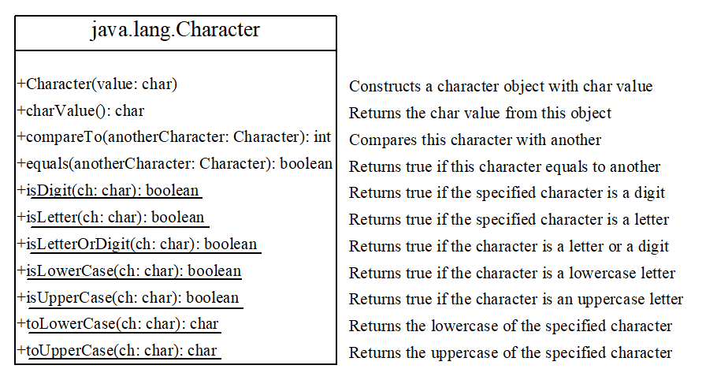
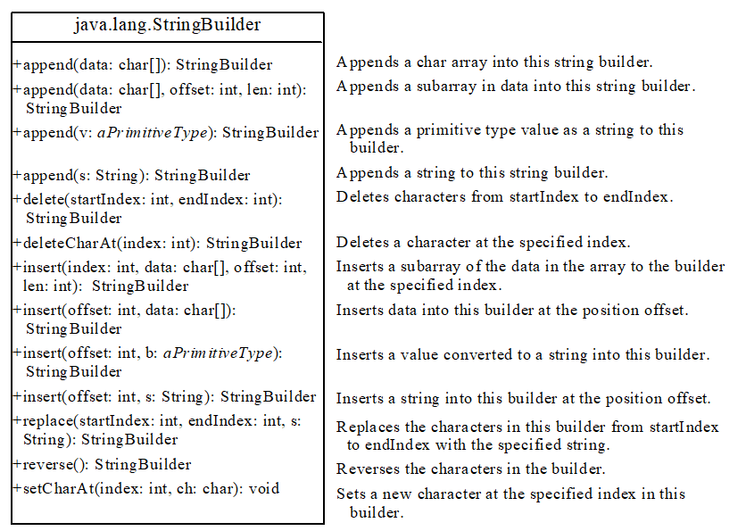
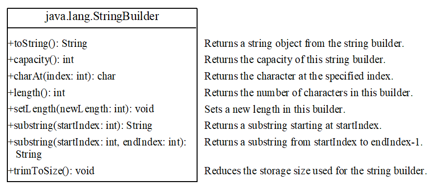

# C5: Classes for Processing String

- A string is: 
  - sequence of characters
  - an immutable (unchangeable) **object**. It can only be "copied" and "reassigned".

## Tech Jargons

- **String variable**: In layman term, it is a "finger"
- **String object**: In layman term, it is a "map".
- **String value**: In layman term, it is the "drawings" on the map.

- **String composition**:
  - A *string variable* "points" to a *string object*, which stores *string value*
  - In layman term, a "String" is a "finger" pointed to a "map" which contains "drawings" on it.

## Constructing Strings

- From a string literal
  - Syntax: `String newString = new String(stringLiteral)`
  - String literal = String, therefore:
    - `String newString = stringLiteral` is okay.
- From array of characters
  - Syntax: `String newString = new String(charArray);`

NOTE: `newString`, `stringLiteral` is user-defined.

## String Methods

### Comparison

- `equals()`: check if ENTIRE string match with another
  - **Pitfall**: `==` only checks if the pointer match.
- `compareTo()`: compares the string's first difference with another
  - return > 0 if first difference is **larger**
  - returns 0 if entire string **same**
  - returns < 0 if first difference **smaller**
  - NOTE: Check **ASCII table** to order

### String Properties

- `length()`: length of String (not address position)
- `charAt()`: get one `char` at the location
  - `userString[0]` does NOT work because `String` is not an array, but an object.
- `indexOf()`: overloaded. In general, returns index of first occurrence of ___ in string. Returns -1 if not matched.
- `lastIndexOf()`: overloaded. In general, same as `indexOf()` but returns last index

### String manipulation

- `concat()`: concatenate the string with another string.
  - Alternative: `+`.
- `subString(beginIndex, [overload: endIndex])` return substring starting from beginIndex to end/endIndex.
- `toLowerCase()`: All lowercase
- `toUpperCase()`: All uppercase
- `trim()`: removes leading & trailing whitespaces
- `replace(oldChar, newChar)`: replace all instance of `oldChar` in String with `newChar`
- `split(token)`, splits a string into an array once it reaches a `token`.

### Conversion

- `valueOf()`: non-String -> String

## `Character` class

## `StringBuilder` and `StringBuffer` class

- Can be used whenever a `String` can be used
- More flexible, mutable class
- Both have same exact methods, can be used interchangeably. 

### `StringBuilder` constructors

### Modifying Strings in `StringBuilder`

## Command-Line Parameters

- The main method gets the arguments from `args[0], args[1], args[2], ..., args[n]`, which corresponds to `arg0, arg1, arg2, ..., argn` in the command line.
  - Example: `java TestMain “First Num” alpha 53`

## Regex Syntax [Optional]

- Not required for exams
- 