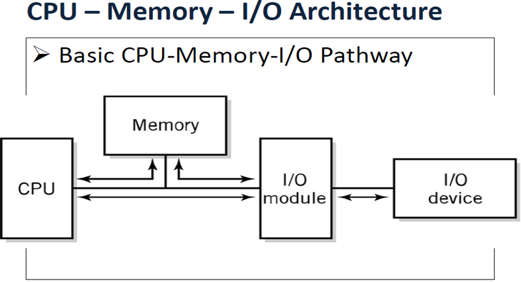

# CSA C11: I/O Facilities

## 1. Characteristics of typical I/O devices

### Keyboard

- Character-based device, one character at a time.
- Types
  - Input request
  - Interrupt
- Multi-user system
  - Many keyboards on one computer
  - Data loss protection, fast response

### Printer

- Wide range of data rates

### Graphical Output

- Object images: Geometrical information. Small size.
- Bitmap images: Data for each pixel. Huge size.

### Disk

- Transfer in blocks

### Requirements for efficient I/O

- Individual access (Parallel access)
- Peripheral device can initiate communication

- Suitable I/O processing technique
- Use suitable control requirements for each device

### Simple I/O configuration

## 2. I/O Techniques

### Techniques

- Programmed IO (PIO)
- Interrupt-driven I/O: External input controls
- Direct Memory Access (DMA): Transfer data between memory and device. Bypass CPU.

## 3. Programmed I/O

- Simplest I/O
- Use bus, connect with data & address register.
- Input from module :arrow_right: CPU (I/O data register :arrow_right: Accumulator register )
- Output go other way round.
- 1 instruction = 1 I/O
- Instruction include address information for device recognition.
- Full fetch-execute cycle
- Used in: KB

## 4. Interrupts

- Signal to CPU to alter flow of execution

### Example

- Illegal instruction
- Multitasking

### Interrupt line

- Special control line, provide interrupt features.
- Message sent = interrupts.

- Cause computer to alter flow of execution

### Servicing Interrupts

- Suspend program
- Save context in PCB (**process control block**) inside stack
- Branch to interrupt handler program (**interrupt routine**)
- Return, restore context from PCB, resume

### Use

#### External Event Notifier

- Notify CPU to take action
- Free CPU from polling
- Control computer from I/O device
- Example: KB input, real-time/time-sensitive system

#### Completion Signal

- Control flow of data to output device
- Notify completion of action
- Example: Printer print sequence.

#### Allocate CPU time

- Allocate time to different programs
- Example: Time sharing (since CPU 1 action 1 time).

#### Abnormal event indicator

- Handle abnormal events
- Example: Power failure

#### Software Interrupts

- Generated by OS
- Same as HW interrupts
- Example: Exception Handler (try-catch exceptions), timer expiration

### Multiple interrupts & prioritization

- Priorities for each interrupt

- Identify device initiating interrupt
  - **Vectored interrupt**: Address included
  - **Polled interrupt**: General interrupt, shared by all
    - Poll each device to identify

## 5. DMA - Direct Memory Access

- Transfer data between devices & memory bypassing CPU
- Conditions:
  - Device & memory connected
  - I/O module can R/W to memory
  - Conflict avoidance between CPU & I/O
    - Cannot load address into MAR at same time
    - Cannot transfer on same bus same timeransfer
- Data required:
  - Location of data on device
  - Starting location of data in memory
  - Size of data
  - Direction of transfer

- Steps
  - Transfer initiated in CPU using programmed I/O
  - CPU bypassed for rest of transfer
  - I/O module notify CPU when complete
- Use
  - Not useful for small transfers, no benefit

## 6. I/O System Architecture

### Basic Components

- CPU
- I/O peripheral device
- Memory
- I/O module(s)
- Bus between components

### I/O Architectures

- Bus architecture: Almost all PC
  - Backbone for connection
  - Number of interconnected buses (CPU, PCI, ISA)
  - Interconnected by bus interface: Expands flexibility, conversion of bus signal
    - Allow same bus, different vendors
    - **Open Architecture** concept
- Channel architecture: IBM mainframe
  - Channel subsystem
  - Extra I/O processor for I/O operations
  - Programs stored in memory
  - Transfer data using DMA
  - **Sub channels**
    - Similar to device controller

## 7. I/O Modules

- Interface between CPU and device. Accept command from CPU, control device

### Functions

- **Recognize message addressed to it**
- **Provide buffer** to hold data.
- **Provide required registers and control (for DMA)**
- **Interrupt capability.** Notify CPU task completion.

### Intermediary interfaces

- **CPU interface**: Between CPU & I/O module
  - Accept commands from CPU
  - Forward interrupts & status info to CPU
- **Device interface:** Supply control of device
  - Accept I/O request
  - Interact with device to fulfill requests
  - Example: move head to correct track on disk

### Benefits for interfaces

- **Simplify CPU I/O instructions**. Complex details handled by interfaces. CPU can be built simpler.
- **Reduce CPU workload**. Simplify interfacing task, free up CPU.
- **Support DMA**. CPU can perform other tasks.
- **Eliminate vendor lock-in**. Specialized circuitry on interface, open source, developers just have to build to support interface.

