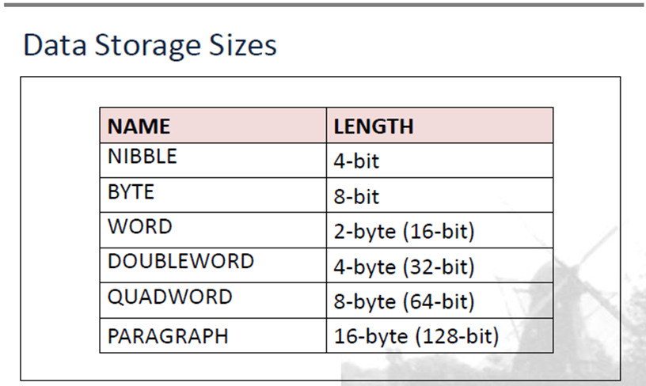

# C3 Segment Memory Mgmt

## 1. Data Storage Sizes



- Generally only need to remember `WORD` and `BYTE`

## 2. Data Addressing

### Little Endian Order (LEO)

- LSB store at first memory address
- `2F 31` (in memory) :arrow_right:`31 2F` (in register)

### Big Endian Order (BEO)

- MSB at first memory address
- `31 2F ` (in memory) :arrow_right:`31 2F` (in register)

## 3. Segmented Memory Management

### Segments & Addressing

- **Real-address Mode**:
  - x86 processor can access 1MB memory using 20 bit address (0 ~ FFFF)
- **Segmented memory**
  - Memory divide into 64KByte units called segments

### Absolute Addressing

- 20-bit value, directly reference location. (E.g. 04A26~H~)

### Segments : Offset Address

- Combines starting address with offset value
- 2 portions:
  - Segment address
  - Offset address

#### Segment Address

- Stored in segment register without last digit
  - `038E0H` :arrow_right: `038EH`
  - Cut from 20-bit to 16-bit

#### Offset Address

- Distance from segment to another location *in segment*.
- Range from `0000H (0D)` to `FFFFH (65,535D)`
- Each segment 64KB

### 20-bit Linear Address Calculation

1. Adjust back to 20bit 

  - Basically segment address \* `10H`

2. Add offset address

3. Formula:
   $$
   PhysicalAddress=(LogicalAddress*10H)+OffsetAddress
   $$

### Segments

- Special areas of memory containing code, data & stack info.
- OS use to track location of program segments.
- Types (X segment, where X is one of the following)
- 4 types
  - **Code** segment: Stores machine *instructions* (AKA code)
  - **Data** segment: Stores defined *variables* & *constants* (AKA data)
  - **Stack** segment: Stores *local function variables* & function *parameters* (or stacks/states)
  - **Extra** segment (not in syllabus)
- Segments can overlap (Multiple segments, same data)

#### Segments vs Segment Register

- Segment register stores address
- Segments store stack information

### Initializing data segment register

- 2-step process
  - Add to AX, then move to DS

### Program Execution Registers

#### Register

- Temporary memory
- High-speed memory
- In 8086,
  - All registers are 16-bit registers
  - general-purpose registers can access as 8/16 bit

#### Categories of register

- General
  - 16 bits: (A/B/C/D)X, E.g.: AX
  - 8 bits: (A/B/C/D)(H/L), E.g.: AL
- Pointer
  - (S/B/I)P
- Index
  - (S/D)I
- Segment
  - (CDSE)S 
- Flag
  - (C/A/S/P/Z/O/I/D/T)F
    - Carry, Aux carry, Sign
    - Parity, Zero, Overflow
    - Interrupt enable, Direction, Single step trap

#### Registers, explained

##### General-purpose registers

- AX, Accumulator register
  - By default, 16 bits, 2 byte.
  - Can divide into 2
    - AH: 1 byte
    - AL: 1 byte
  - Use for arithmetic, input/output, multiply, divide
  - Double size: EAX (Extended AX)
- BX, Base register
  - Break into BH and BL
  - Use for arithmetic, index
- CX, Count register
  - Break into CH and CL
  - Use for arithmetic, loop
- DX, Data register
  - Break into DH and DL
  - Use for same as AX.
  - DX is usually for bigger number, smaller number is AX

##### Segment

- Registers
  - CS - Code: Starting address of program CS
    - CS + IP = address of instruction for execution
  - DS - Data, starting address of program DS
    - Locate data
    - DS + instruction offset value (inside instruction) = specific byte location
  - SS - Segment
    - Implement stack in memory, temporarily store address & data.
    - SS + SP = current word being addressed in stack
  - ES - Extra
    - Used in string operation, handle memory addressing
    - Initialize with appropriate segment address

##### Index registers

- Types
  - SI - Source Index
    - Some string handling
  - DI - Destination Index
    - String operations
- To store index if BX is not enough

#### Pointers

- Registers, hold offset, associate with other base registers
  - IP - Instruction
  - SP - Stack
  - BP - Base
- Stores offset address
  - Mandatory matching
  - CS:IP (CS must match with IP)
  - SS:SP
  - SS:BP

### Flag Registers (Second Highlight)

- Indicate state of activities
- Flag registers, only 1 actual register, 16 bits (1 bit = 1 flag)
  - CF (Carry Flag)
    - Indicate carry bit
    - Set when:
      - unsigned too big
      - extra 1 bit after signed calculation
    - States:
      - CY: Carry
      - NC: No carry
  - OF
    - Indicate overflow (ONLY signed)
    - Set when:
      - Result of signed arithmetic too big (i.e. The result's sign is opposite of both operand's sign)
    - OV: Overflow
    - NO: No overflow
  - AF
    - Carry from 3rd to 4th bit
    - Auxiliary Carry Flag
    - AC: Auxiliary Carry
    - NA: No auxiliary
  - ZF
    - Indicate result is zero
    - ZR: Zero
    - NZ: Not zero
  - SF
    - Indicate result's sign
    - PL: Positive
    - NG: Negative
  - PF
    - Set if result have even number of 1 bits
    - States:
      - PE: Parity Even
      - PO: Parity Odd
    - Use for error checking
  - AF
    - Set when carry from bit 3 to bit 4 *in 8 bit operation*
    - Important for BCD addition & subtraction.
    - AC: Auxiliary Carry
  - Control flags
    - TF: Single step
    - IF: Interrupt
    - DF: Directions
      - DN: Down
      - UP: Up
- Exercise
  - 0101 1010 + 0000 + 0010 = 0101 1100
    - Flags: NV, UP, EI, PL, NZ, NA, PE, NC
  - 1000 0100 + 1001 0011 = 1 0001 0111
    - Flags: OV, UP, EI, PF, NZ, NA, PE, CY
- Chapter Review
  - Data storage sizes
  - Data addressing
  - Segmented Memory Management
  - 

### Using DOSBox

- ```
  mount c: c\8086
  debug
  -r
  ```


