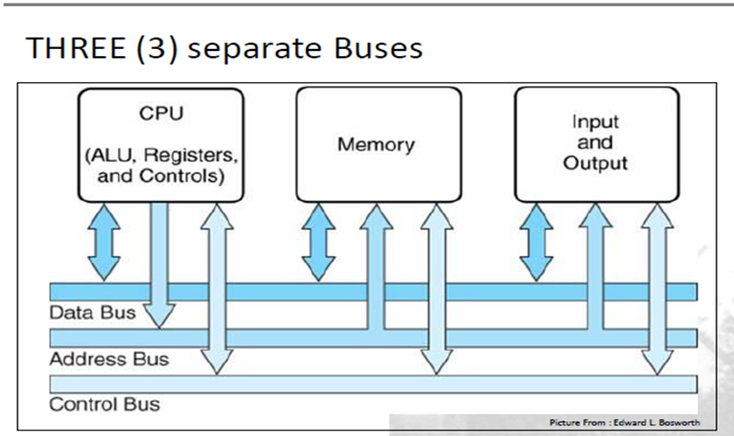
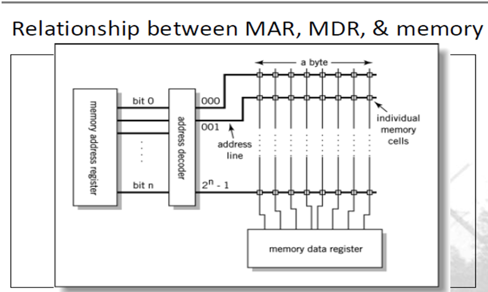
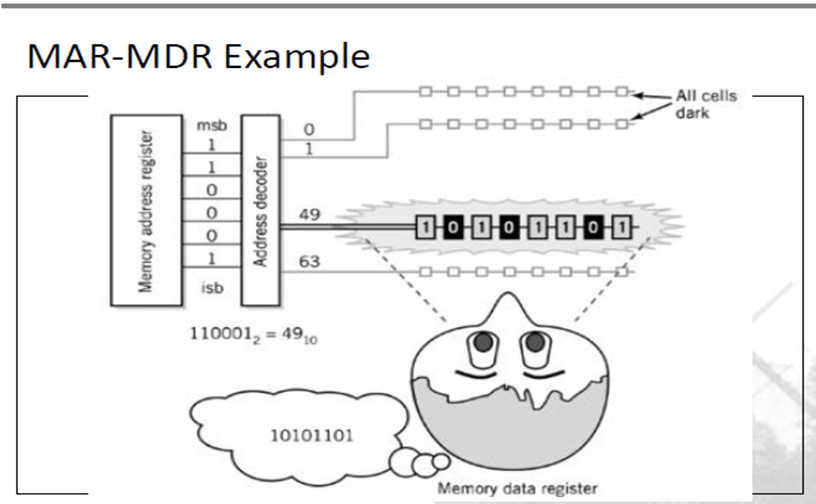
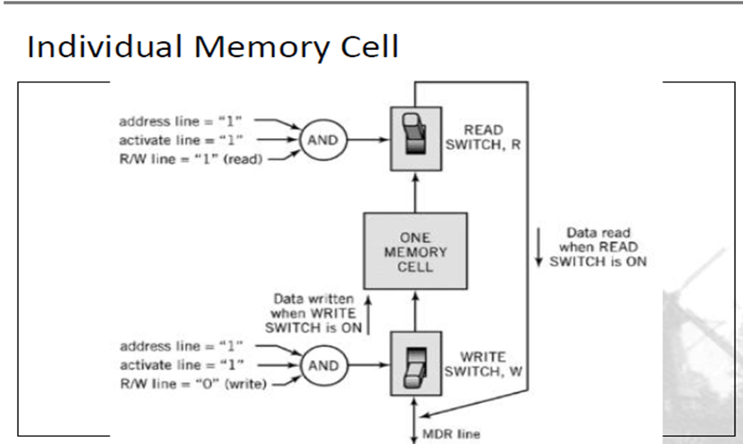
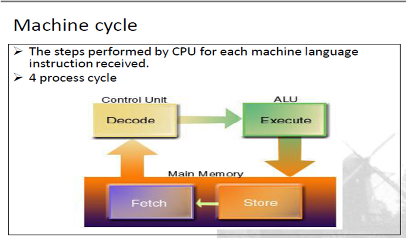

# CSA C4: Computer Architecture

## 0. Exam Tips

1. Remember
   Use of PC, MAR, MDR, IR, Accumulator
2. Exam must remember machine cycle, 4 steps
3. Exam must remember all instruction steps (STORE, ADD, etc)
4. Exam must remember 5 main features of RISC over CISC

## 1. IPO(S) Model

- **IPO(S):** Input-Process-Output (Storage) Model
- **Computer System:** Collection of HW & Software working together to perform computing task.
- A program receive input, perform processing, produce output and store in storage device.

## 2. Major comp. of comp. systems

### Primary Components

- HW component
  - Tangible physical part of system.
  - Any EEM (Electrical, Electronic, Mechanical) equipment making up computer.
- SW component
  - Intangible part of system
  - Tell computer what to do
  - System software & application software
- Data component
  - Main task of computers.
- Comm. component
  - HW & SW that transport data between interconnected systems.
  - Enables sharing & collaborative work

### HW Component (CPU)

#### Three components

- **Arithmetic and Logic Unit (ALU)**
  - Arithmetic, Boolean logical calculations.
- **Control Unit (CU)**
  - Decode instructions, control execution & data movement.
- **Interface Unit**
  - Move instruction and data between CPU and devices.
  - Interconnect CPU with other devices on motherboard.

### HW Component (Memory)

- Working Storage
- **Store program concept**: Store instructions processed/to-be-processed by CPU.
- Consists of storage cells, sequentially numbered, individually addressable.
- Basic size = 1 byte, can be grouped to store larger data types.

| Volatile Memory                                  | Non-volatile memory             |
| ------------------------------------------------ | ------------------------------- |
| Holds data temporarily while CPU processing them | Permanent memory                |
| Require constant power                           | Does not require constant power |
| Primary storage                                  | Secondary storage               |
| RAM                                              | ROM                             |

### SW Component (System SW)

- Control operations of computer & devices
- Interface between SW and HW.

| OS                                | Utilities                                         |
| --------------------------------- | ------------------------------------------------- |
| Coordinate activities & resources | Perform specific task, correct computer problems. |

### SW Component (Application SW)

- Solve user's computing/specific task
- **Personal application software**: General-purpose programs to support individual.

### Communication Components (HW)

- **Communication channels**
  - Provide connection between computers
  - E.g.: Wire cable, Fiber optic cable
- **Interface hardware**
  - Handle comm. between computer and comm. channel
  - Modem/NIC

### Communication Components (SW)

- Protocols
  - Define communication rules
  - Allow communicate with other computer through network.

## 3. Buses

- Physical connection to transfer data INSIDE computer system.
  - Peripherals <-> CPU
  - CPU <-> Memory
  - Different points within CPU
- Electrical conductors called "line", named, and carries computer signal.
- **Purpose:** Reduce "pathways" for communication.
  - 
- Buses
  - 

### Bus Lines

#### Data Bus

- Transport data
- Bidirectional
- More lines, higher data rate.

#### Address Bus

- Specify data recipient, identifies source/destination of data on data bus.
- Bus width = max memory. If CPU has N lines, can address 2^n^ locations.

####  Control Bus

- Provide control for synchronization & control of bus & modules connected.
- Bidirectional.
- Typical: I/O write/read, Reset, Clock

#### Internal & External Bus

- Internal bus: Communication between internal components
  - ISA, PCI, AGP
- External bus: Communication with external components
  - SATA, PATA, SCSI, GPIB, IDE

#### Point to Point Bus

- Linked to only 2 components/devices
- Example: Printer cable

#### Multipoint Bus

- Linked to multiple points.
- Signals are "broadcasted" to all points.
- Example: Ethernet.

### Chipset

- Component routing data between buses
- Components:
  - Northbridge (memory controller)
    - Control transfer between processor and RAM
  - Southbridge (I/O controller / expansion controller)
    - Control communication between peripheral devices

## 4. Component of CPU

**Function:** Manipulate data, execute instructions

- Major components:
  - ALU - calculations, comparisons, logic operations.
  - CU - Directs and coordinate operations in computer.
    - **Memory management unit**: Manage & fetch data from memory.
    - **I/O interface**: Combined with Mem. M.U. to form Bus Interface Unit
  - Registers

## 5. Concept of Registers

### Registers

- Special, high-speed storage area in CPU
- Hold data temporary
- Difference from memory:
  - Each register different role
  - Not addressed like memory

#### General-purpose registers (GPR)

- Accumulator/user-visible registers
- Inside ALU
- Hold data for operations & data transfer.

#### Special purpose registers (SPR)

- Found in CU
- Examples
  - **Program counter register (PC)** - holds next instruction for execution
  - **Instruction register (IR)** - hold current instruction
  - **Memory address register (MAR)** - hold address of memory location
  - **Memory data register (MDR)** - hold data being retrieved/stored by MAR

#### Flag registers

- 1 bit register
- Indicate special condition

## 6. Memory Unit

### Retrieval process

- **MAR**: holds address to be open for data access
- **MDR**: 
  - Store a copy of data pointed by MAR for read access.
  - Store data into memory for write-access
  - Size of MDR determine word size accessible in one operation.

| Read Operation                        | Write Operation               |
| ------------------------------------- | ----------------------------- |
| CPU copy address to MAR.              | SAME                          |
| CPU set R/W switch to `ON/1`          | CPU set R/W switch to `OFF`/0 |
| CPU set activation line `ON`          | SAME                          |
| Data: Memory Location -> MDR register | Data transfer                 |
| Data: MDR register -> Register        |                               |

### RAM - Random Access Memory

#### DRAM (Dynamic RAM)

- Common, cheap
- Must be refreshed periodically

#### SRAM (Static RAM)

- Uncommon, expensive
- No need periodic refreshing, much faster
- Used in cache

### ROM - Read Only Memory

- Non-volatile, permanent storage

#### EEPROM (Electrically Erasable Programmable ROM)

- Slower, less flexible than Flash ROM

#### Flash ROM

- Faster than disks, more expensive
- Used in: BIOS

## 7. Fetch-execute instruction cycle

- Exam must remember machine cycle, 4 steps

### Fetch Phase

- **Fetch**: Get instruction from memory
- **Decode:** Translate to computer commands

### Execute Phase

- **Execute**: Execute computer commands
- **Store:** Write results to memory.
- **ADD/MUL/DIV/SUB**: Arithmetic

### Table for reference

- Note, all instructions must start with `FETCH` instructions first. If question ask for `LOAD`  means write `FETCH` contents first, then `LOAD` contents

<table class="tg">
  <tr>
    <th class="tg-7btt" colspan="3">
FETCH
</th>
  </tr>
  <tr>
    <td class="tg-c3ow" colspan="3">
PC -&gt; MAR
</td>
  </tr>
  <tr>
    <td class="tg-c3ow" colspan="3">
MDR -&gt; IR
</td>
  </tr>
  <tr>
      <td class="tg-7btt">
<strong>LOAD</strong>
</td>
    <td class="tg-7btt">
<strong>STORE</strong>
</td></td>
    <td class="tg-7btt">
<strong>ADD/MUL/DIV/SUB</strong>
</td>
  </tr>
  <tr>
    <td class="tg-c3ow" colspan="3">
IR[Address] -&gt; MAR
</td>
  </tr>
  <tr>
    <td class="tg-c3ow">
MDR -&gt; A
</td>
    <td class="tg-0pky">
A -&gt; MDR
</td>
    <td class="tg-0pky">
A +*/ MDR -&gt; A
</td>
  </tr>
  <tr>
    <td class="tg-baqh" colspan="3">
PC + 1 -&gt; PC
</td>
  </tr>
</table>

## 8. CISC & RISC architecture

CPU architecture is defined by characteristics & features, such as:

- Number & type of registers
- Methods of addressing memory
- Basic design & layout of instruction set

### CISC - Complex Instruction Set Computer

#### Characteristics

- Few general-purpose registers
- Many addressing techniques
- Example: x86 family
- Normally used for low-end stuff: IoT and so on

#### Drawbacks

- **More steps to complete simple instruction**: More steps to complete

### RISC - Reduced Instruction Set Computer

#### Characteristics

- Many general-purpose registers
- Limited addressing techniques
- Limited, simple instruction set
- Example: PowerPC

#### Benefits (Important)

- **Simple instruction**: Try to execute within same clock interval
  - Faster, higher clock speed, simple hardware
- **Registers-oriented instructions**: Reduce memory access, use registers to hold instructions
- **Fixed-length/format instruction word**: Easy to identify. Can be fetch/decoded independently -> pipelining
  - Pipelining: Start another task before previous task end
- **Limited addressing mode**: Single address mode, speed up execution
- **Large bank of registers:** Registers widely applied, reduce memory access

