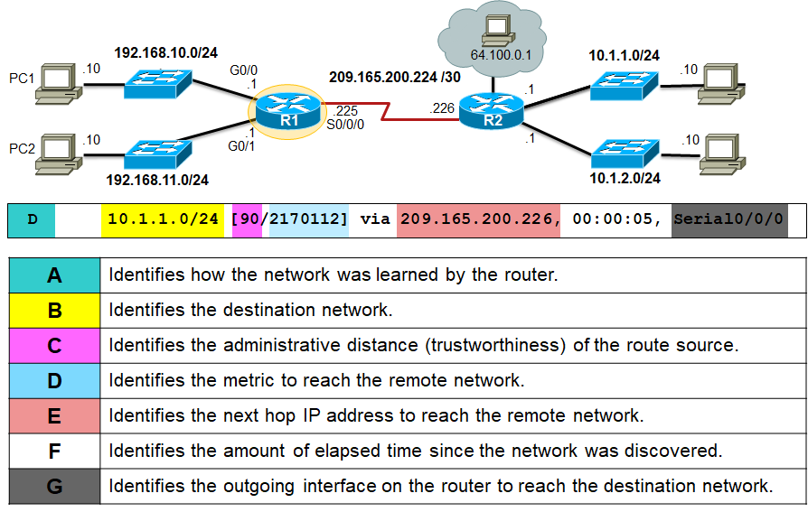
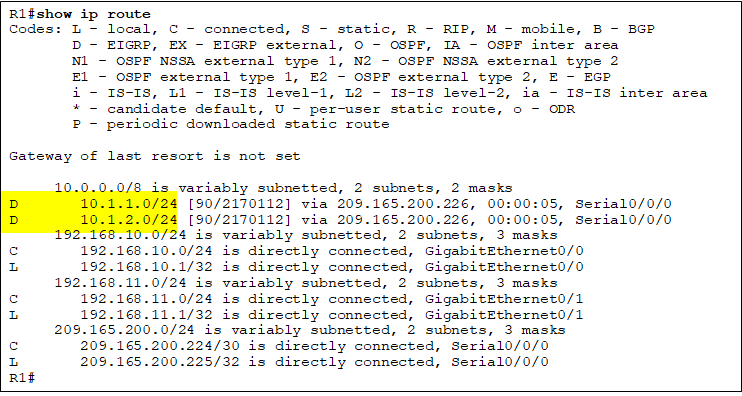

# C6: Network Layer

### Final Exam

- "Directly Connected Routing Table Entries"

## Objectives

- Explain how network layer protocols & services support communications
- Explain how routers enable connectivity
- Determine appropriate device to route traffic
- Configure router

## 6.1 Network Layer Protocols

- Network = 3rd layer of OSI model
  - Path Determination
  - IP (Logical Addressing)

### Network layer (Host-to-Host communication)

- **Addresses** packets with IP Address.
- **Encapsulate** packets
- **Routes** packets
- **Decapsulates** packets

### IP

- Internet Protocol
  - Common: IPv4 & IPv6
  - Only **Layer 3 protocol** used in **Internet**
- Focus of course

## Characteristics of IP

- **Connectionless**: No connection before sending data
  - Sender:
    - don't know if receiver is there
    - arrival status
    - readability
  - Receiver:
    - don't know arrival time
- **Best effort** (unreliable): No overhead to guarantee delivery
  - No capability to manage & recover problematic packets
  - Other layer manage reliability
- **Media independent**: Operates independently of medium
  - Concerned with size of packet or MTU (max transmission unit)
  - MTU, communication between Data Link & Network layer
  - **Fragmentation:** Router split up packets with smaller MTU than limit.
- **Packaging Transport Layer PDU**
  - Segment Header + Data
- **Features of IP** packet header
  - Version 
  - Header checksum: Reconstruction of fragments 
  - Type of Service: Throughput priority (8 bits)
  - **Time To Live (TTL)**: Max "hops" before drop
  - **Source IP Address**: 32-bit
  - **Destination IP Address**: 32-bit

### Limitations of IPv4

- IP Address Depletion. Limited number of unique public IP address.
- Routing table expansion. IPv4 has more nodes, many are badly configured, more overhead.
- Lack of end-to-end connectivity. IPv4 uses Network Address Translation (NAT) for multiple devices to share single public IP. As a result, end-to-end connectivity becomes problematic as the device do not have its own public IP. 

### IPv6

- Increased address space
- Better packet handling
- Eliminate NAT
- Integrated security
- Header similarities with IPv4:
  - Version
  - Source & destination address

## 2. Routing - Host Routing Tables

### Host Packet Forwarding Decision

- IP address of router is default gateway (in most cases)

### Default Gateway

- Hosts must maintain own routing table
- Typical contents:
  - Direct connection
  - Local network route
  - Local default route

### Router Packet Forwarding Decision

- Directly connected network
  - within 1 hop
- Remote networks
  - More than 1 hop

### IPv4 Router Routing Table

- To display, use `netstat -r` 

### Directly connected routing table entries

- 
- For Part A:
  - `C`: Connected
  - `L`: Link local
- For part B:
  - For `C`: Refers to network connected
  - For `L`: Refers to the interface IP address
- For Part C:
  - Nothing special, just refers to ports

### Remote Network Routing Table Entries

- For Part A, B and G is similar to the local.
- For `D`: Lower values indicate faster routes

### Next-Hop Address

- On the image above `D`  refers to `EIGRP`  which is  Enhanced Interior Gateway Routing Protocol. It is a routing protocol that searches for the best route to destination.
- According to the image, the two highlighted points have a `via 209.165.200.226`. This is the interface of the next hop.

## 3. Routers

- Routers are computers

### Components - Memory

| Memory | Volatility   | Stores                                                     |
| ------ | ------------ | ---------------------------------------------------------- |
| RAM    | Volatile     | Run OS, config files, routing & ARP tables, packet buffer. |
| ROM    | Non-volatile | Bootup instructions, basic diagnostics, limited IOS        |
| NVRAM  | Non-volatile | Startup config files                                       |
| Flash  | Non-volatile | OS, System files                                           |

## OSI Model

- **PDU:** Packet Data Unit

## Communication from Host-to-Host

- **Network Layer**: Communication from one host to another.

- Only layer 3 protocol used in Internet.
- Final may ask to explain characteristics of IP
- Routing: Very important topic
- If you get all 0.0.0.0 for your IP, it is called default IP address (6.2 Routig Sample IPv5 Host Routing Table) Final exam may ask similar question, will give you different IP, and explain what can you understand about the diagram and the table. To answer: Router R1 will have 2 networks, [list down the IP address], in order for router network A to route to network B, the packets need to pass through the default gateway [write dg ip here]. 5 networks in the diagram
  - Note: Default gateway need to point to the EXIT point of the network, not any other gateways.
  - That topology have 2 network, sometimes question might ask you to label
  - If say in network A: 192.168.10.1, then need to pass to default gateway (which is the center route)
  - Gateway check source & destination
  - Gateway points to 192.168.10.1
- `show ip route`: (During exam will have, show all the path)
  - `d` = dynamic routing protocol (1 hop away)
  - `c` = directly connected
  - `l` = local (all on same network all have IP)
- ADminstativedistance (or whatever that is) need to be memorized

