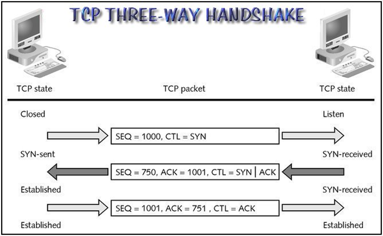

# C9: Transport Layer

## 7.0 Introduction

- **Role:** Establish temporary session, send data between two applications
- **Services**:
  - Connection-oriented data stream support
  - Reliability
  - Flow control
  - Multiplexing
- **Responsibilities:**
  - Track individual conversation
  - Segment & reassemble data segments (divide data for transportation)
  - Identify applications
    - Segment data, interleave for transmission
    - Add header to identify & manage data

## 7.1 Transport Layer Protocols

- Responsible for managing reliability
- Protocols
  - **TCP**: Reliable, full-featured
  - **UDP**: Unreliable, minimal

### TCP - Transmission Control Protocol

- Reliable, supports packet delivery confirmation
- Basic operations
  - Numbering & tracking segments
  - Acknowledging received data
  - Retransmitting after timeout
- Good when:
  - Segments must arrive in specific sequence
  - All data must be received to be useful
  - Applications: Database, Web browsers, E-mail clients

#### TCP Features

- **Connection-oriented**: Ensure application ready to receive data.
- **Reliable Delivery**: Lost segments are resent.
- **Same-order delivery**: Ensure proper-order reassembly.
- **Flow control**: Ensure receiver can process data.

### UDP - User Datagram Protocol

- Unreliable, fast.
- Very little overhead & data checking.
- Good when:
  - Data loss is tolerable
  - Delay unacceptable
  - Applications: Live video/audio streaming, Voice over IP (VoIP), fast-paced online games

#### UDP Features

- Exact opposite of TCP features above

### Responsibilities

#### Multiple Separate Conversation

- Must separate & manage each communication
- Handle simultaneous applications communication
- **Port numbers**: Unique identifies in header to manage multiple communication.

#### Port numbers

- Source port
  - Dynamically chosen, use to track conversations (especially in HTTP)
  - Act as return address
- Destination Port
  - Identify application or service in server

#### Socket Pairs

- **Socket:** Source/Destination IP + Source/Destination Port Number (must match source-source)
- **Socket pair:** Combination of 2 sockets
- Enable differentiation of processes

### Port Number Groups

- **Well-known Ports**: Reserved for services & applications.
- **Registered Ports**: Assigned ports to entities
- **Dynamic/Private Ports**: Temporary ports, assigned dynamically to identify applications

### `netstat` Command

- Verify active connections in host

## 7.2 TCP and UDP

## 7.2.1: TCP Communication Process

### TCP Server Processes

- Each application = 1 unique port number
- **Open port:** Port with active server application
- Can have multiple open ports

### TCP Connection Establishment (3 Steps)

- Client request client-to-server comm. session
- Server acknowledge client-to-server comm. request server-to-client comm.
- Initiating client acknowledges server-to-client communication session

### TCP Connection termination

1. Client send FIN flag
2. Server send ACK back, terminate client-to-server session
3. Server send FIN to terminate server-to-client session
4. Client send ACK back
5. Close session

### TCP Connection, Establishment, and Termination

- Connection-oriented protocol
  - Set **initial window** + **sequence number**
  - Use **three-way handshake**
    - 3 TCP segments
    - 3 TCP flags
      - `SYN` - Synchronize sequence numbers
      - `ACK` - Acknowledgement received data
      - `FIN` - No more data
- For connection, must **synchronize** initial sequence numbers (**ISNs**)
  - **ISN:** Starting sequence number
  - **Sequence number:** Track order, ensure no lost
  - **Flag fields:** Identify type of segment
  - `ACK` always +1 sequence number.
  - 

## 7.2.2 Reliability & Flow Control

### Reliability - Ordered Delivery

- Use sequence number to:
  - Identify & acknowledge each segment
  - Keep track of segment order
  - Indicate assembly & reassembly guide
- Segment out-of-order are held for later processing.

### Reliability - Sequence number & acknowledgement

- Ensure destination reachable & ready to receive data
- Allow retransmission
- Ensure proper order
- **FIN flag:** Gracefully end
- **RST flag:** Abruptly terminate

### Reliability - Data Loss & Retransmission

- Mechanism to retransmit segment for acknowledgement data

### Flow Control - Window Size and Acknowledgements

- Mechanisms for flow control, ensure reliable delivery
- Adjust rate of data flow automatically during session

### Flow Control - Congestion Avoidance

- Estimate congestion, reduce sent bytes on detection
- Destination unaware of congestion, no need to suggest new window size.

### UDP Low Overhead

- Simple, basic, lower overhead
- Not connection-oriented. No retransmission, sequencing, flow control
- Reliability implemented in application layer

### UDP Datagram Reassembly

- No way to reorder, assembly in order received
- Application must identify proper sequence

### UDP Server Processes

#### Server Side

- UDP-based server applications assigned registered/well-known ports
- Accept UDP client requests.
- Requests received on specific port forwarded to application

#### Client Side

- UDP-based client dynamically select port & use as source port
- Use source-destination ports in header, reverse when receiving

## 7.2.4 Applications

### Application using TCP

- Handles all transport layer tasks
- Application can hand over data stream to transport layer & TCP will handle the rest
- Example: HTTP, FTP, SMTP, Telnet

### Applications using UDP

- Live video & multimedia applications - can tolerate loss but not delay
- Simple requests & reply applications - may not receive reply, e.g. DNS & DHCP
- Application handling reliability themselves. Unidirectional communication. Example: Simple Network Management Protocol (SNMP), Trivial File Transfer Protocol (TFTP).

## 7.3 Summary

### Final exam

- What type of application suitable for TCP and what type suitable for UDP
- Focus on 5 chapters, not coming out in finals
- Explain 2-3 TCP features
- Examination, TCP three way handshake, give sequence number ,explain whole process
  - Host will send sequence number to destination
  - Destination send seq= host seq + 1,
- List 3 TCP & UDP applications

### Extras

TCP three way handshake

Assume host Sequence number = 1000, detination sequent number 750

