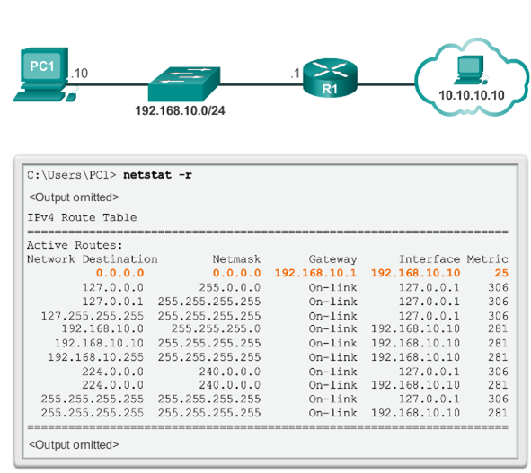
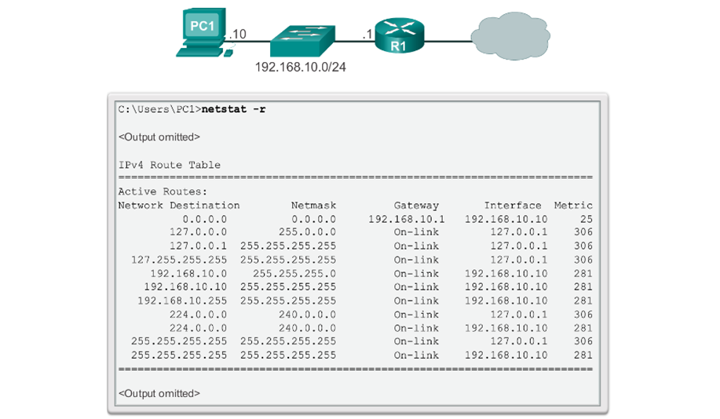

# Final Exam Tips

## Coverage

- C6-10

## C6

- Functions & characteristics of IP (3 characteristics) :star:
  - Connectionless
  - Best effort
  - Media independent
- Limitations of IPv4 :star:
  - Understand, very important (all 3)
  - IP Address depletion
    - Assume host 2^32^ not enough to cater IP addresses for human population
  - Routing table expansion
    - Routing table becomes huge
  - Lack of end-to-end connectivity
    - Hard to connect from one to another end-to-end
- IPv6 benefits :star:
  - Make sure you can explain all 4 points (refer to Netacad)
  - Increased address space
  - Improved packet handling
  - Eliminate need for NAT
    - Understand: If use IPv4 address, when we want to route to internet, will have translation (from private to public) because not enough public IPv4 address for all devices.
  - Integrated security

- IPv4 Host Routing Table
  - Need to know how to see the routing table
  - 6.2 Routing: Sample IPv4 Host Routing Table
    - 
    - Need to know which one is network destination, network, subnet mask, and gateway address
    - When we meet the router, need to circle a broadcast domain
    - You have to know why the answer is like that. 
    - If want to route from PC1 to PC2, what is the network destination
      - Answer should be 0.0.0.0 (because can't fine 10.10.10.10) inside the broadcast area.
      - If want to route to another network, need to look for network destination. But unfortunately, can't find the subnet address in then network destination. Router will then send by default, broadcast to everyone. Which is why you get router destination 0.0.0.0, which means using default static route, which means will not match with any IP addresses. Subnet mask also turn off, any IP address will just go to gateway. your interface start from source, your metric is 25.
      - PC1 will be source. PC2 will be destination. If 10.10.10.10 is /8, can you find any address inside the network destination (insid the table), then you need to go default route 0.0.0.0. However, if you can find it, then your answer is simply the line of Network Destination, Network Mask, Gateway, Inerface, and Metric inside the table.
  - 6.2 Routing: IPv4 Host Routing Table
    - 
  - If say the cloud is 224.0.0.0, then just copy own that line
  - If say you can't find, then answer is simply the 0.0.0.0 line.

- Router memory, function of all :star: :star:

## C7

- Assume already know how to do subnetting and VLSM

- The need for IPv6, include additional advancements

- IPv4 and IPv6 Coexistence :star:

  - How to migrate from IPv4 to IPV6
  - Dual-stack
  - Tunneling
  - Translation (NAT46 = from IPV4 to IPV6) , if (NAT64 = from IPv6 to IPv4)

- :star: :star: Rule 1 & Rule 2 of IPv6 address (shortening)

  - Rule 1: eliminate zero in front, don't remove behind

    - Write steps, steps also got marks

    - Answer write:

      

  - Rule 2: eliminate all 0 segments (can only use 1 time)

- :star: 3 types of IPv6 (Unicast, multicast, anycast)

  - Explanation 

- :star: :star: IPv6 Unicast Address

  - Global
  - Link-local
  - ...
  - Need to know what is everything

-  :star: ICMPv4 and ICMPv6 message

  - 4 messages common to both ICMPv4 and v6 (memorize all 4)

## C8 - Test you for calculation part

### Reasons for subnetting

### Reasons for VLSM

### How to Subnet & VLSM

- The question (for both) is VERY similar to VLSM workbook
  - They give you a map, write the IP address. Then they give you a table and ask you to subnet.
  - Example: 
    - 10 host for subnet A, 50 host for subnet B, 100 host for subnet C, refer to VLSM workbook. VERY Similar to that.
    - Question to list down first & last usable subnet address
- AFAIK Not similar to subnetting workbook, which means no "calculate growth" kind of question.

## C9

- Differences in TCP vs UDP
  - Explain 5 differences in TCP vs UDP
  - Benefits
  - Disadvantages
  - Make sure all know
- Focus on TCP and UDP preferences
  - Why TCP preferable
  - Why UDP preferable
- TCP Three-way handshake for termination parts
  - Make sure how to explain connection, establishment, and termination
- Steps for TCP Session Termination
  - Make sure to know how to draw the diagram
  - FIN means finish
  - Make sure destination agree
  - Finish receive the number 2....
  - Session termination

- Summary: Focus characteristics, examples, applications used by TCP & UDP, Why TCP preferable to UDP and why UDP preferable to TCP

## C10

- Refer to NetAcad
- Go for application Layer
- Mail Transfer : IMAP, POP, SMTP
  - How they work, especially IMAP
  - From one sender to receiver to server
  - Understand how IMAP operating works
- IMAP, POP3, SMTP operation also study

